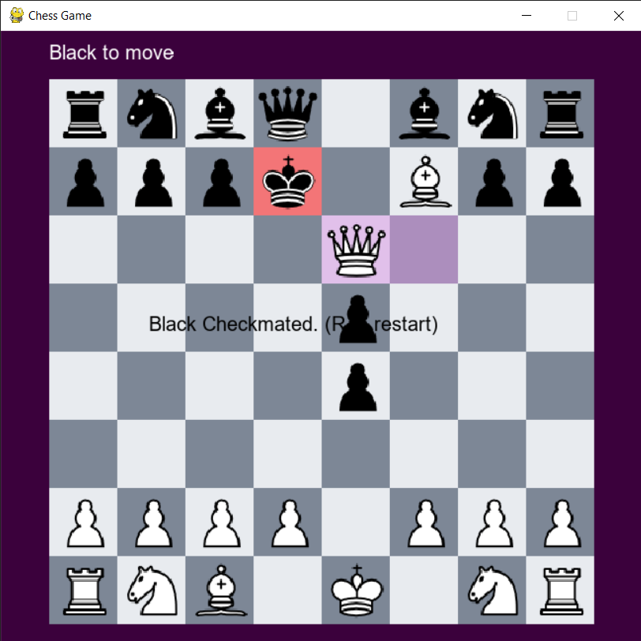
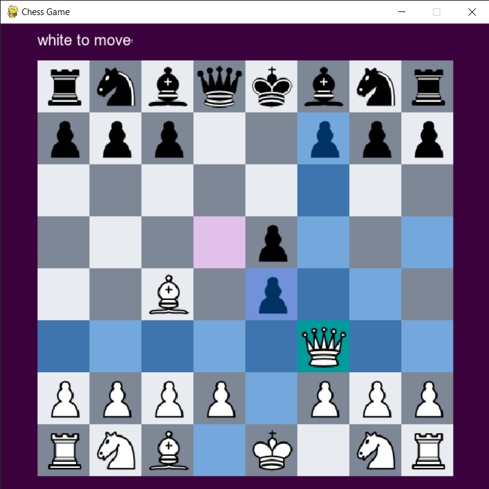

# Chess Engine     

## About Chess    
Chess is a strategical two player board game played on a 8x8 checkered board     
where a player tries to capture opponent's king while protecting his own with the     
help of 16 pieces and 6 types each of which has a unique set of possible moves.    

## How to Run    
1. Download the repository as zip and extract it.    
2. [Python](https://www.python.org/) should be installed on the system.     
3. Open command prompt in the extracted folder.     
4. Run this command: `pip install -r requirements.txt`     
5. Run the game with this command: `python game.py`     
6. Choose game mode from command prompt.     
6. Enjoy !!🙂     

## Images    
    
     

## How Engine works    

### General     
Engine keeps track of the turn and if that player selects a piece, all the valid     
moves of that piece are highlighted and if square is selected among those,     
the move is played and turn switches to other player. Game ends when the     
player in turn has no valid moves left.    

### How Check is detected    
All the moves of opponent's pieces are generated and if any of the piece     
is attacking the king, the current player is in check.    

### How valid moves are decided
All possible moves of selected piece are generated.     
- If the king is in check and a move doesn't prevent it, it is not valid.     
- If the king is not in check, but a move causes check, it is not valid.     

### How Computer mode works    
Player is given option to choose it's preferred color.    
After player has made the move, computer generates a move for it's color.     
The move is played and waits for next player move.    
 

There are several versions which have differnet ways of generating moves:    
1. **Random Move Generator**: All the pieces are iterated one by one if the piece has any valid move.     
A random number is generated. If the number is greater than the threshold, that piece is selected to make     
the move and a random move among the valid moves is made.    
2. **Greedy Move Generator**: The move which results in capturing highest scored     
piece from opponent immediately is selected. If no move results in capturing,     
a random move is selected.     
3. **Minimax Algorithm**: Minimax is extended version of greedy algorithm where instead    
for each move of one player all moves of opponent are generated and so on    
and best score among all cases is selected.    

### Theory of Minimax Algorithm    
_Coming Soon_